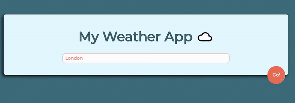

# Weather App

> This is a Node JS application that will help you check current weather all around the world. Make sure you won't be suprised by the weather.

## Table of contents

- [Technologies](#technologies)
- [Setup](#setup)
- [Features](#features)

## Technologies

- JavaScript ES6
- Bootstrap - version 4.0
- Node JS - version 12.19.0
- Express JS - version 4.17.1

## Setup

To run this project install it locally using npm:

- cd.../WeatherApp
- npm install
- npm start

Link to application: https://morning-citadel-27233.herokuapp.com/

## Features

- Write city name and press "Go" button
- Check the current temperature
- Colors depends on the current weather and the time of the day
